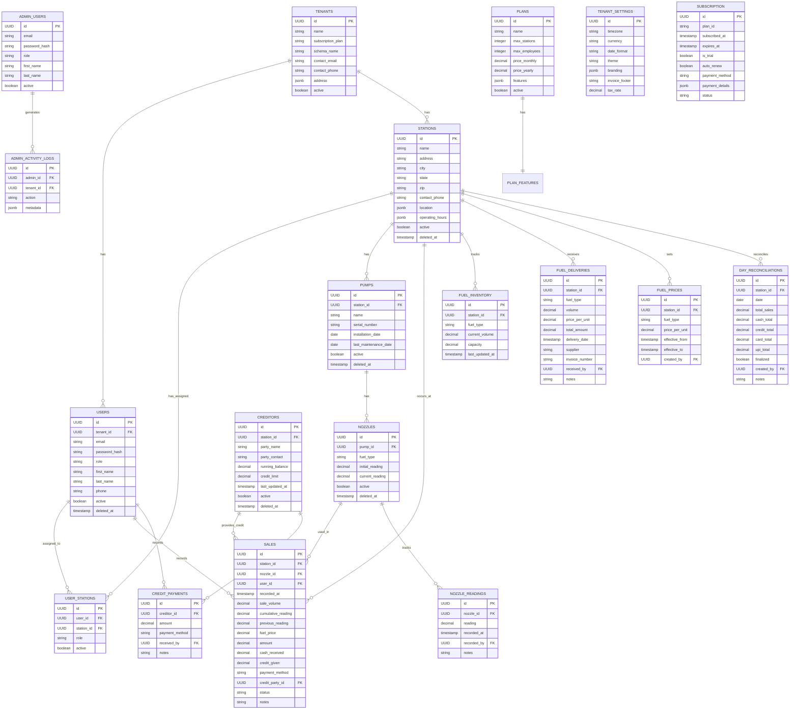

# FuelSync Hub - Database Schema

This document provides a comprehensive overview of the FuelSync Hub database schema, including entity relationships and data flow.

## Entity Relationship Diagram



## Key Entities and Relationships

### Public Schema

1. **Tenants**
   - Represents fuel station companies using the platform
   - Each tenant has its own schema for data isolation
   - Associated with a subscription plan

2. **Plans**
   - Subscription plans available to tenants
   - Defines limits and features available to tenants

3. **Admin Users**
   - Platform administrators (superadmins)
   - Manage tenants, users, and system settings

4. **Admin Activity Logs**
   - Record of administrative actions
   - Used for auditing and troubleshooting

### Tenant Schema (per-tenant)

1. **Users**
   - People who use the system (owners, managers, employees)
   - Each user belongs to a specific tenant
   - Users can be assigned to specific stations

2. **Stations**
   - Physical fuel stations
   - Each station belongs to a tenant
   - Stations have pumps, which have nozzles

3. **Pumps**
   - Fuel dispensing equipment at stations
   - Each pump belongs to a station
   - Pumps have multiple nozzles for different fuel types

4. **Nozzles**
   - Individual fuel dispensers on pumps
   - Each nozzle has a specific fuel type
   - Nozzles are used to record sales

5. **Sales**
   - Fuel sales transactions
   - Each sale is associated with a station, nozzle, and user
   - Sales can be paid by cash, card, or credit

6. **Creditors**
   - Entities that receive credit for fuel purchases
   - Associated with credit sales
   - Can make payments to settle outstanding balances

7. **Fuel Inventory**
   - Tracks current fuel levels at stations
   - Updated through sales and deliveries

8. **Fuel Deliveries**
   - Records of fuel deliveries to stations
   - Updates fuel inventory levels

## Data Flow

### User Registration and Management

1. Superadmin creates a tenant
2. Tenant owner is created with the tenant
3. Tenant owner creates stations and users
4. Users are assigned to stations

### Sales Process

1. User logs in to the system
2. User selects a pump/nozzle
3. User records a sale with volume and payment method
4. If payment method is credit, a creditor is associated
5. Sale is recorded in the database
6. Nozzle readings are updated

### Credit Management

1. Credit sales are associated with creditors
2. Creditors can make payments to settle outstanding balances
3. Payments are recorded against specific creditors

### Reconciliation Process

1. Manager performs daily reconciliation
2. System calculates totals from sales records
3. Manager verifies cash, card, and credit totals
4. Reconciliation is finalized and stored

### Reporting

1. Sales data is aggregated for reports
2. Credit reports show outstanding balances
3. Inventory reports track fuel levels
4. Compliance reports check tenant adherence to business rules

## Database Schema Details

### Public Schema

#### Tenants Table

```sql
CREATE TABLE tenants (
  id UUID PRIMARY KEY,
  name TEXT NOT NULL,
  subscription_plan TEXT NOT NULL,
  schema_name TEXT NOT NULL UNIQUE,
  created_at TIMESTAMP DEFAULT CURRENT_TIMESTAMP,
  updated_at TIMESTAMP DEFAULT CURRENT_TIMESTAMP,
  active BOOLEAN DEFAULT true,
  contact_email TEXT,
  contact_phone TEXT,
  address JSONB
);
```

#### Plans Table

```sql
CREATE TABLE plans (
  id UUID PRIMARY KEY,
  name TEXT NOT NULL UNIQUE,
  max_stations INTEGER NOT NULL,
  max_employees INTEGER NOT NULL,
  price_monthly NUMERIC(10,2) NOT NULL,
  price_yearly NUMERIC(10,2) NOT NULL,
  features JSONB NOT NULL,
  created_at TIMESTAMP DEFAULT CURRENT_TIMESTAMP,
  updated_at TIMESTAMP DEFAULT CURRENT_TIMESTAMP,
  active BOOLEAN DEFAULT true
);
```


#### Admin Users Table

```sql
CREATE TABLE admin_users (
  id UUID PRIMARY KEY,
  email TEXT NOT NULL UNIQUE,
  password_hash TEXT NOT NULL,
  first_name TEXT NOT NULL,
  last_name TEXT NOT NULL,
  role TEXT NOT NULL,
  created_at TIMESTAMP DEFAULT CURRENT_TIMESTAMP,
  updated_at TIMESTAMP DEFAULT CURRENT_TIMESTAMP,
  last_login TIMESTAMP,
  active BOOLEAN DEFAULT true
);
```

#### Admin Activity Logs Table

```sql
CREATE TABLE admin_activity_logs (
  id UUID PRIMARY KEY,
  admin_id UUID NOT NULL REFERENCES admin_users(id),
  tenant_id UUID REFERENCES tenants(id),
  action TEXT NOT NULL,
  metadata JSONB,
  created_at TIMESTAMP DEFAULT CURRENT_TIMESTAMP
);
```

### Tenant Schema (per-tenant)

#### Users Table

```sql
CREATE TABLE users (
  id UUID PRIMARY KEY,
  email TEXT NOT NULL UNIQUE,
  password_hash TEXT NOT NULL,
  role TEXT NOT NULL,
  first_name TEXT NOT NULL,
  last_name TEXT NOT NULL,
  phone TEXT,
  created_at TIMESTAMP DEFAULT CURRENT_TIMESTAMP,
  updated_at TIMESTAMP DEFAULT CURRENT_TIMESTAMP,
  last_login TIMESTAMP,
  active BOOLEAN DEFAULT true,
  deleted_at TIMESTAMP
);
```

#### User Sessions Table

```sql
CREATE TABLE user_sessions (
  id UUID PRIMARY KEY,
  user_id UUID NOT NULL REFERENCES users(id),
  login_time TIMESTAMP NOT NULL,
  logout_time TIMESTAMP,
  ip_address TEXT,
  user_agent TEXT,
  device_info JSONB
);
```

#### Activity Logs Table

```sql
CREATE TABLE activity_logs (
  id UUID PRIMARY KEY,
  user_id UUID NOT NULL REFERENCES users(id),
  action TEXT NOT NULL,
  entity_type TEXT NOT NULL,
  entity_id UUID,
  metadata JSONB,
  created_at TIMESTAMP DEFAULT CURRENT_TIMESTAMP
);
```

#### Tenant Settings Table

```sql
CREATE TABLE tenant_settings (
  id UUID PRIMARY KEY,
  timezone TEXT,
  currency TEXT,
  date_format TEXT,
  theme TEXT,
  branding JSONB,
  invoice_footer TEXT,
  tax_rate NUMERIC(5,2),
  created_at TIMESTAMP DEFAULT CURRENT_TIMESTAMP,
  updated_at TIMESTAMP DEFAULT CURRENT_TIMESTAMP
);
```

#### Subscription Table

```sql
CREATE TABLE subscription (
  id UUID PRIMARY KEY,
  plan_id TEXT NOT NULL,
  subscribed_at TIMESTAMP NOT NULL,
  expires_at TIMESTAMP,
  is_trial BOOLEAN,
  auto_renew BOOLEAN,
  payment_method TEXT,
  payment_details JSONB,
  status TEXT NOT NULL,
  created_at TIMESTAMP DEFAULT CURRENT_TIMESTAMP,
  updated_at TIMESTAMP DEFAULT CURRENT_TIMESTAMP
);
```

#### Stations Table

```sql
CREATE TABLE stations (
  id UUID PRIMARY KEY,
  name TEXT NOT NULL,
  address TEXT,
  city TEXT,
  state TEXT,
  zip TEXT,
  contact_phone TEXT,
  location JSONB,
  operating_hours JSONB,
  created_at TIMESTAMP DEFAULT CURRENT_TIMESTAMP,
  updated_at TIMESTAMP DEFAULT CURRENT_TIMESTAMP,
  active BOOLEAN DEFAULT true,
  deleted_at TIMESTAMP
);
```

#### User Stations Table

```sql
CREATE TABLE user_stations (
  id UUID PRIMARY KEY,
  user_id UUID NOT NULL REFERENCES users(id),
  station_id UUID NOT NULL REFERENCES stations(id),
  role TEXT NOT NULL,
  created_at TIMESTAMP DEFAULT CURRENT_TIMESTAMP,
  updated_at TIMESTAMP DEFAULT CURRENT_TIMESTAMP,
  active BOOLEAN DEFAULT true
);
```

#### Pumps Table

```sql
CREATE TABLE pumps (
  id UUID PRIMARY KEY,
  station_id UUID NOT NULL REFERENCES stations(id),
  name TEXT NOT NULL,
  serial_number TEXT,
  installation_date DATE,
  last_maintenance_date DATE,
  created_at TIMESTAMP DEFAULT CURRENT_TIMESTAMP,
  updated_at TIMESTAMP DEFAULT CURRENT_TIMESTAMP,
  active BOOLEAN DEFAULT true,
  deleted_at TIMESTAMP
);
```

#### Nozzles Table

```sql
CREATE TABLE nozzles (
  id UUID PRIMARY KEY,
  pump_id UUID NOT NULL REFERENCES pumps(id),
  fuel_type TEXT NOT NULL,
  initial_reading NUMERIC(12,3) NOT NULL,
  current_reading NUMERIC(12,3) NOT NULL,
  created_at TIMESTAMP DEFAULT CURRENT_TIMESTAMP,
  updated_at TIMESTAMP DEFAULT CURRENT_TIMESTAMP,
  active BOOLEAN DEFAULT true,
  deleted_at TIMESTAMP
);
```

#### Nozzle Readings Table

```sql
CREATE TABLE nozzle_readings (
  id UUID PRIMARY KEY,
  nozzle_id UUID NOT NULL REFERENCES nozzles(id),
  reading NUMERIC(12,3) NOT NULL,
  recorded_at TIMESTAMP NOT NULL,
  recorded_by UUID NOT NULL REFERENCES users(id),
  notes TEXT
);
```

#### Fuel Prices Table

```sql
CREATE TABLE fuel_prices (
  id UUID PRIMARY KEY,
  station_id UUID NOT NULL REFERENCES stations(id),
  fuel_type TEXT NOT NULL,
  price_per_unit NUMERIC(10,2) NOT NULL,
  effective_from TIMESTAMP NOT NULL,
  effective_to TIMESTAMP,
  created_by UUID NOT NULL REFERENCES users(id),
  created_at TIMESTAMP DEFAULT CURRENT_TIMESTAMP,
  updated_at TIMESTAMP DEFAULT CURRENT_TIMESTAMP
);
```

#### Creditors Table

```sql
CREATE TABLE creditors (
  id UUID PRIMARY KEY,
  station_id UUID NOT NULL REFERENCES stations(id),
  party_name TEXT NOT NULL,
  party_contact TEXT,
  running_balance NUMERIC(10,2) NOT NULL,
  credit_limit NUMERIC(10,2),
  last_updated_at TIMESTAMP NOT NULL,
  created_at TIMESTAMP DEFAULT CURRENT_TIMESTAMP,
  updated_at TIMESTAMP DEFAULT CURRENT_TIMESTAMP,
  active BOOLEAN DEFAULT true,
  deleted_at TIMESTAMP
);
```

#### Sales Table

```sql
CREATE TABLE sales (
  id UUID PRIMARY KEY,
  station_id UUID NOT NULL REFERENCES stations(id),
  nozzle_id UUID NOT NULL REFERENCES nozzles(id),
  user_id UUID NOT NULL REFERENCES users(id),
  recorded_at TIMESTAMP NOT NULL,
  sale_volume NUMERIC(12,3) NOT NULL,
  cumulative_reading NUMERIC(12,3),
  previous_reading NUMERIC(12,3),
  fuel_price NUMERIC(10,2) NOT NULL,
  amount NUMERIC(10,2) NOT NULL,
  cash_received NUMERIC(10,2),
  credit_given NUMERIC(10,2),
  payment_method TEXT NOT NULL,
  credit_party_id UUID REFERENCES creditors(id),
  status TEXT NOT NULL,
  notes TEXT,
  created_at TIMESTAMP DEFAULT CURRENT_TIMESTAMP,
  updated_at TIMESTAMP DEFAULT CURRENT_TIMESTAMP
);
```

#### Credit Payments Table

```sql
CREATE TABLE credit_payments (
  id UUID PRIMARY KEY,
  creditor_id UUID NOT NULL REFERENCES creditors(id),
  amount NUMERIC(10,2) NOT NULL,
  paid_at TIMESTAMP NOT NULL,
  payment_method TEXT NOT NULL,
  received_by UUID NOT NULL REFERENCES users(id),
  notes TEXT,
  created_at TIMESTAMP DEFAULT CURRENT_TIMESTAMP,
  updated_at TIMESTAMP DEFAULT CURRENT_TIMESTAMP
);
```

#### Day Reconciliations Table

```sql
CREATE TABLE day_reconciliations (
  id UUID PRIMARY KEY,
  station_id UUID NOT NULL REFERENCES stations(id),
  date DATE NOT NULL,
  total_sales NUMERIC(12,2) NOT NULL,
  cash_total NUMERIC(12,2) NOT NULL,
  credit_total NUMERIC(12,2) NOT NULL,
  card_total NUMERIC(12,2) NOT NULL,
  upi_total NUMERIC(12,2) NOT NULL,
  finalized BOOLEAN NOT NULL,
  created_by UUID NOT NULL REFERENCES users(id),
  notes TEXT,
  created_at TIMESTAMP DEFAULT CURRENT_TIMESTAMP,
  updated_at TIMESTAMP DEFAULT CURRENT_TIMESTAMP
);
```

#### Fuel Inventory Table

```sql
CREATE TABLE fuel_inventory (
  id UUID PRIMARY KEY,
  station_id UUID NOT NULL REFERENCES stations(id),
  fuel_type TEXT NOT NULL,
  current_volume NUMERIC(12,3) NOT NULL,
  capacity NUMERIC(12,3) NOT NULL,
  last_updated_at TIMESTAMP NOT NULL,
  created_at TIMESTAMP DEFAULT CURRENT_TIMESTAMP,
  updated_at TIMESTAMP DEFAULT CURRENT_TIMESTAMP
);
```

#### Fuel Deliveries Table

```sql
CREATE TABLE fuel_deliveries (
  id UUID PRIMARY KEY,
  station_id UUID NOT NULL REFERENCES stations(id),
  fuel_type TEXT NOT NULL,
  volume NUMERIC(12,3) NOT NULL,
  price_per_unit NUMERIC(10,2) NOT NULL,
  total_amount NUMERIC(12,2) NOT NULL,
  delivery_date TIMESTAMP NOT NULL,
  supplier TEXT,
  invoice_number TEXT,
  received_by UUID NOT NULL REFERENCES users(id),
  notes TEXT,
  created_at TIMESTAMP DEFAULT CURRENT_TIMESTAMP,
  updated_at TIMESTAMP DEFAULT CURRENT_TIMESTAMP
);
```

## Business Rules and Constraints

1. **Tenant Requirements**:
   - Each tenant must have at least one owner
   - Each tenant must have at least one station

2. **Station Requirements**:
   - Each station must have at least one pump
   - Each station must have at least one assigned user

3. **Pump Requirements**:
   - Each pump must have at least two nozzles (for different fuel types)

4. **Fuel Types**:
   - Standard types: petrol, diesel, premium, super, cng, lpg
   - Must be consistent across tenant schemas

5. **Payment Methods**:
   - Standard types: cash, card, upi, credit
   - Must be consistent across tenant schemas

## Multi-Tenancy Approach

FuelSync Hub uses a schema-based multi-tenancy approach:

1. Each tenant has its own PostgreSQL schema
2. The public schema contains shared tables (tenants, plans, admin users)
3. Tenant-specific data is stored in the tenant's schema
4. The application sets the search_path to the tenant's schema for each request
5. This provides strong data isolation between tenants

## Extending the Schema

When extending the schema, consider the following:

1. **Multi-tenancy**: All tenant-specific data should be in the tenant's schema
2. **Soft Deletion**: Use deleted_at timestamps instead of deleting records
3. **Audit Trail**: Include created_at and updated_at timestamps
4. **Referential Integrity**: Use foreign keys to maintain data consistency
5. **Business Rules**: Enforce business rules through triggers and constraints