# FuelSync Hub - Data Flow Diagrams

This document provides data flow diagrams for the FuelSync Hub platform, illustrating how data moves through the system.

## System Context Diagram

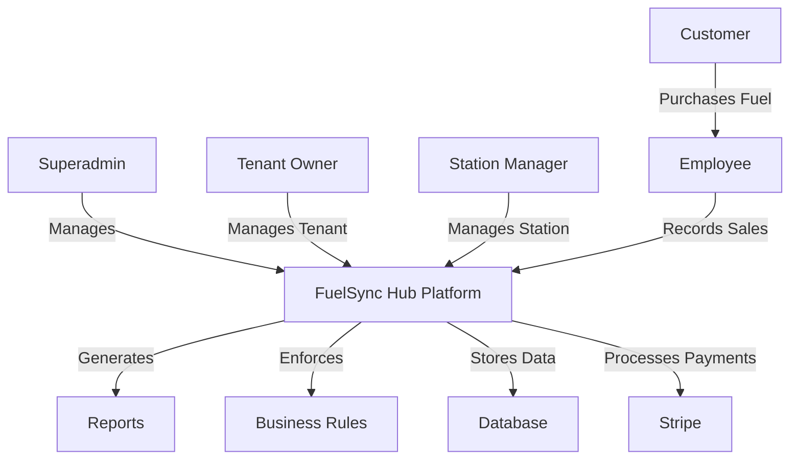

## Architecture Overview

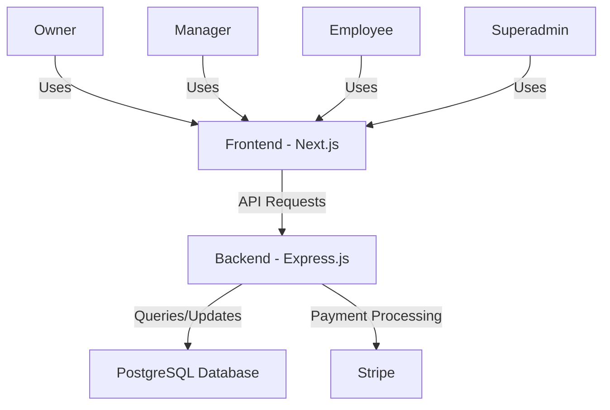

## User Management Flow

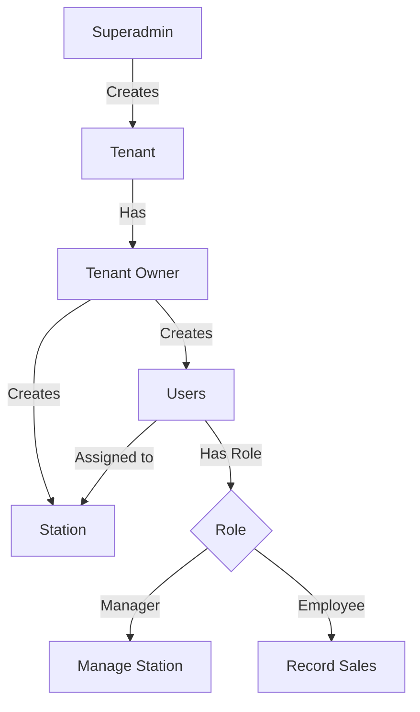

## Sales Process Flow

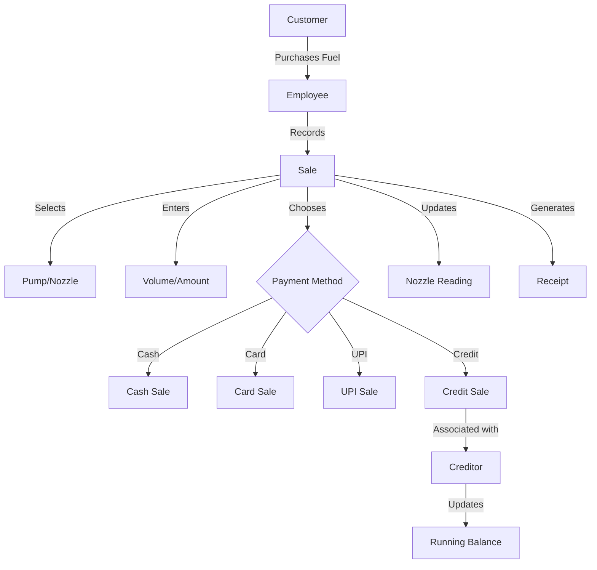

## Reconciliation Process

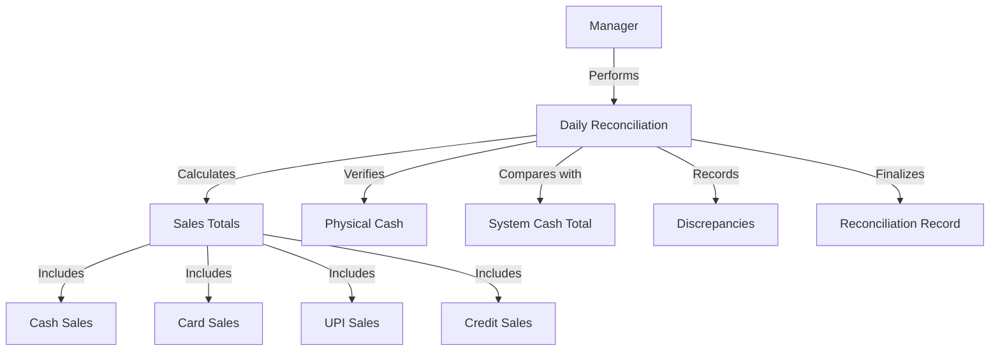

## Inventory Management Flow

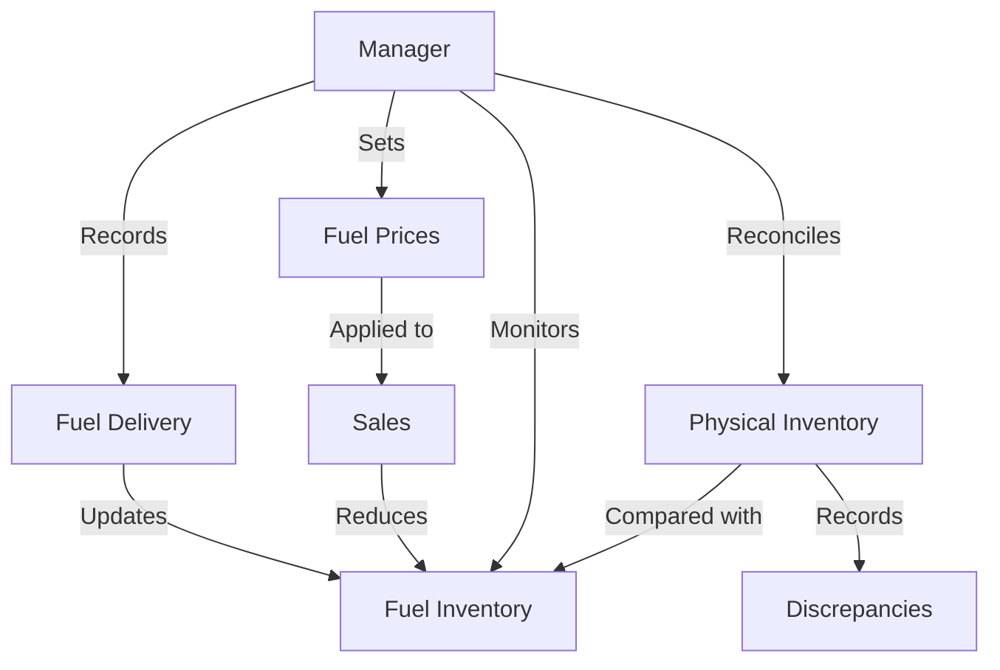

## Credit Management Flow

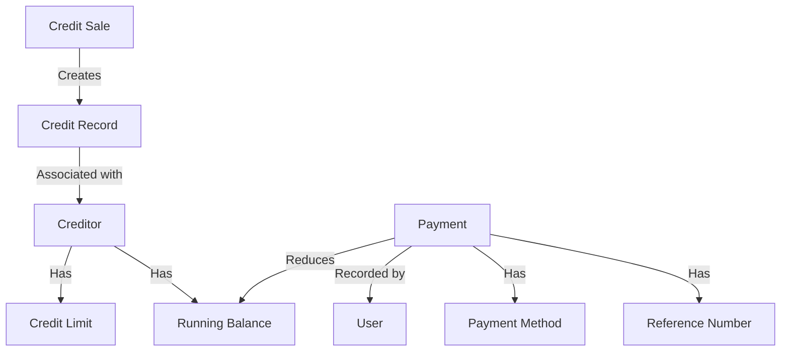

## Reporting Flow

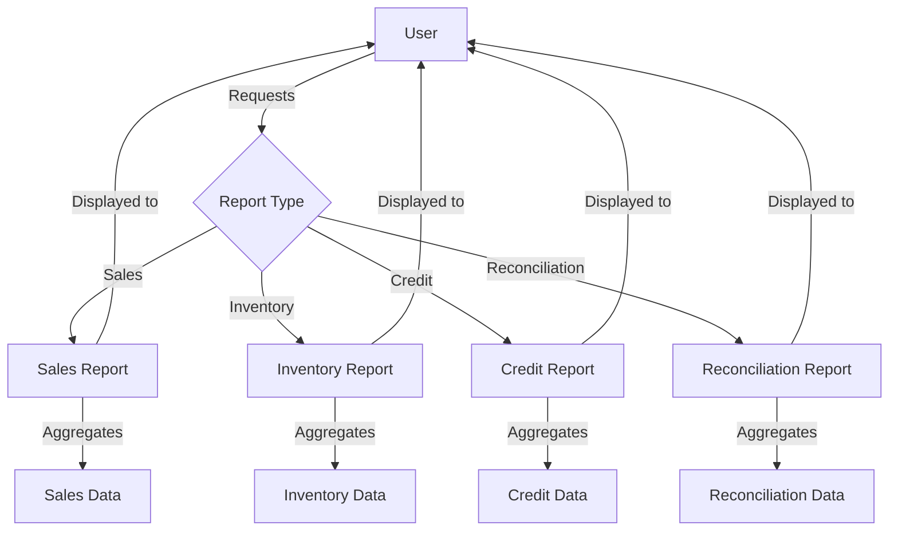

## Data Access Patterns

### Superadmin Access

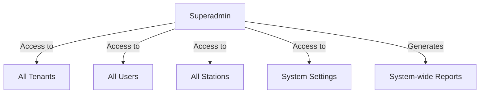

### Tenant Owner Access

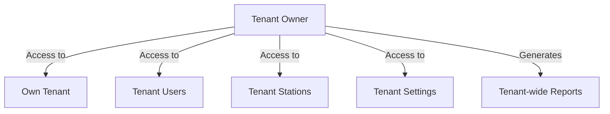

### Station Manager Access

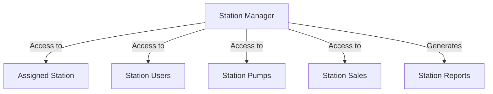

### Employee Access

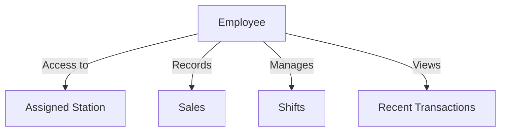

## Authentication and Authorization Flow

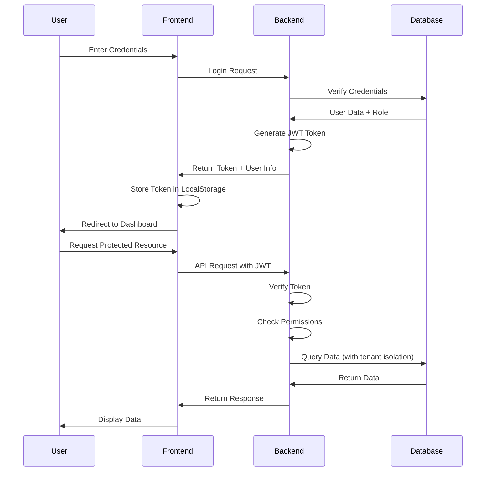

## Multi-tenancy Data Flow

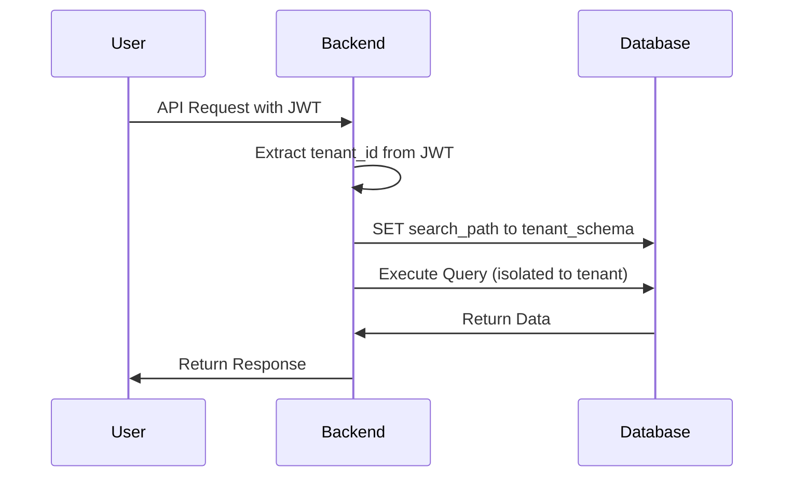

## Data Creation Sequence

### Setting Up a New Tenant

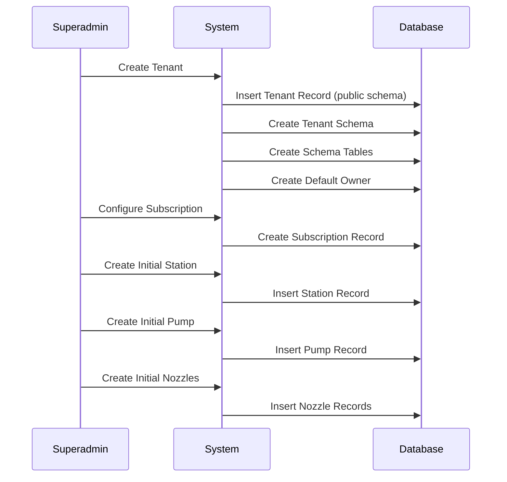

### Recording a Sale

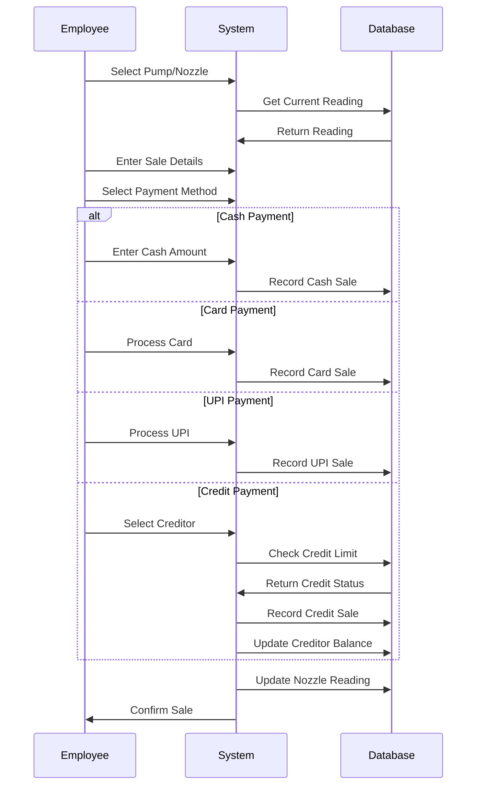

## Using This Documentation

This documentation provides a comprehensive view of the FuelSync Hub data flow. Use it to:

1. **Understand Processes**: See how data flows through different processes
2. **Identify Dependencies**: Understand how components interact
3. **Plan Extensions**: Add new features while maintaining data integrity
4. **Debug Issues**: Trace data through the system to identify problems
5. **Train New Developers**: Help new team members understand the system architecture

When implementing new features, consider:

1. **Multi-tenancy**: Ensure data is properly isolated between tenants
2. **Authentication**: Verify user permissions for each operation
3. **Data Integrity**: Maintain referential integrity between related entities
4. **Audit Trail**: Log important actions for troubleshooting and compliance
5. **Error Handling**: Implement proper error handling and recovery