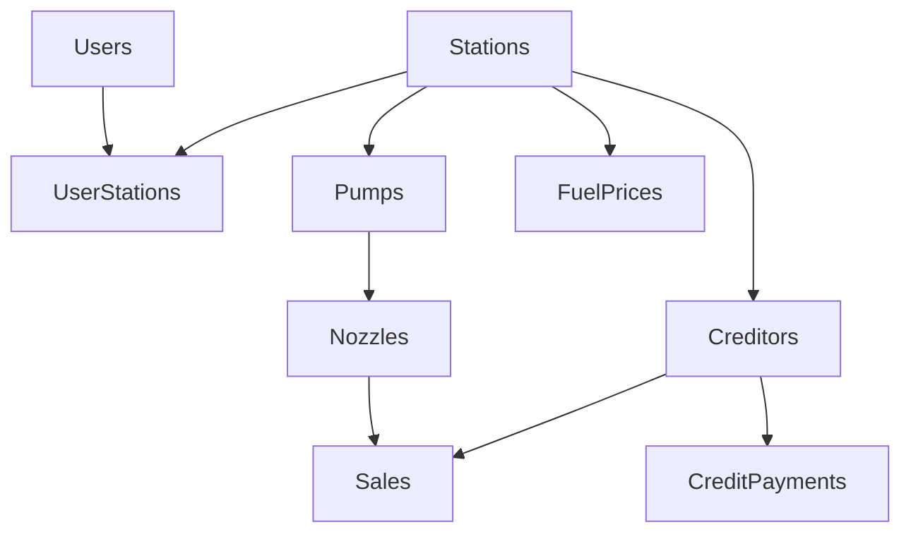

# Database Management Guide

## Table Dependencies


## Migration Rules

1. **Naming Convention**
   - Format: `NNN_description.sql`
   - Example: `001_init_schema.sql`

2. **Order of Operations**
   - Drop triggers first
   - Drop functions second
   - Drop tables in reverse dependency order
   - Create types
   - Create tables
   - Create indexes
   - Create triggers

3. **Safety Practices**
   - Always use transactions
   - Include IF EXISTS in drops
   - Add proper constraints
   - Create indexes for foreign keys

4. **Validation Rules**
   - Email format validation
   - Numeric range checks
   - Timestamp consistency
   - Foreign key integrity

## Adding New Tables

1. Create migration file:
```sql
BEGIN;
-- 1. Add new types if needed
CREATE TYPE new_type AS ENUM (...);

-- 2. Create table with constraints
CREATE TABLE new_table (
    id UUID PRIMARY KEY,
    created_at TIMESTAMP DEFAULT CURRENT_TIMESTAMP,
    updated_at TIMESTAMP DEFAULT CURRENT_TIMESTAMP
);

-- 3. Add timestamp trigger
CREATE TRIGGER trg_update_timestamp
    BEFORE UPDATE ON new_table
    FOR EACH ROW
    EXECUTE FUNCTION update_timestamp();

-- 4. Add indexes
CREATE INDEX idx_new_table_field ON new_table(field);

COMMIT;
```

## Data Validation

```sql
-- Check data integrity
SELECT 
    (SELECT COUNT(*) FROM sales 
     WHERE amount != sale_volume * fuel_price) as invalid_amounts,
    (SELECT COUNT(*) FROM nozzles 
     WHERE current_reading < initial_reading) as invalid_readings,
    (SELECT COUNT(*) FROM user_stations us
     LEFT JOIN users u ON us.user_id = u.id
     WHERE u.id IS NULL) as orphaned_assignments;
```

## Common Commands

```bash

# Setup database
npm run db:setup

# Validate schema
npm run db:validate

# Reset database
npm run db:reset
```
