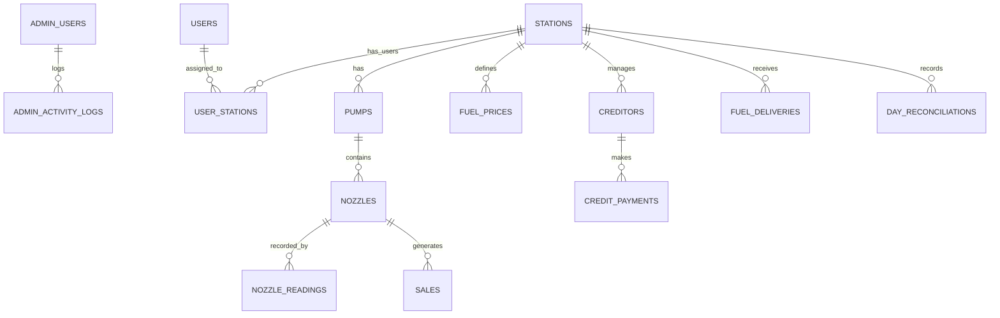

# DATABASE\_GUIDE.md — FuelSync Hub

This guide documents the database schema, relationships, and key queries used in the FuelSync ERP system.

---

## 📊 Entity Relationship Overview



---

## 🔄 Core Tables by Domain

### User Access

* `admin_users` ➔ Superadmin login/auth
* `users` ➔ Tenant users (owner, manager, attendant)
* `user_stations` ➔ Links users to stations + roles

### Tenant Scope

* `tenants` ➔ Each tenant has a schema
* `plans`, `plan_features` ➔ Plan enforcement
* `tenant_settings` ➔ Branding, currency, theme

### Station Management

* `stations` ➔ Fuel station info
* `pumps`, `nozzles` ➔ Nested hardware hierarchy

### Operational Data

* `nozzle_readings` ➔ Manual readings
* `sales` ➔ Generated by delta readings
* `fuel_prices` ➔ Price per fuel type
* `fuel_deliveries` ➔ Restock records
* `fuel_inventory` ➔ Tank levels
* `day_reconciliations` ➔ Daily sales summary

### Credit & Payments

* `creditors` ➔ Named credit parties
* `credit_payments` ➔ Payment against credits

### Activity Logs

* `admin_activity_logs`
* `activity_logs`
* `user_sessions`

---

## 🪡 Sample Business Queries

### 1. All Sales for a Station (last 7 days)

```sql
SELECT * FROM sales
WHERE station_id = $1
  AND recorded_at >= NOW() - INTERVAL '7 days';
```

### 2. Nozzle Reading Gaps / Invalids

```sql
SELECT * FROM nozzle_readings nr
JOIN nozzles n ON nr.nozzle_id = n.id
WHERE nr.reading < n.initial_reading;
```

### 3. Total Outstanding Credit

```sql
SELECT SUM(running_balance) FROM creditors
WHERE active = TRUE;
```

### 4. Daily Summary (Reconciliation)

```sql
SELECT date, total_sales, cash_total, credit_total
FROM day_reconciliations
WHERE station_id = $1
ORDER BY date DESC LIMIT 7;
```

### 5. Top Creditors by Balance

```sql
SELECT party_name, running_balance
FROM creditors
ORDER BY running_balance DESC
LIMIT 5;
```

---

## 📊 Notes

* All monetary values are in **INR (₹)**
* Reading-based sales use cumulative model:

  ```ts
  sale_volume = new_reading - previous_reading
  amount = sale_volume * fuel_price
  ```
* Data integrity enforced via triggers + foreign keys
* Multi-tenancy achieved via schema-per-tenant model

---

> Next: See `TROUBLESHOOTING.md` for known issues & debugging guidance.
