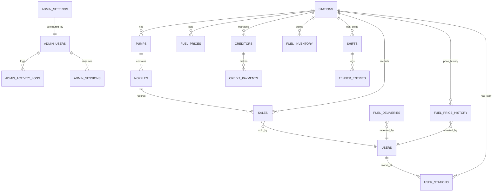

```mermaid
erDiagram
    ADMIN_USERS ||--o{ ADMIN_ACTIVITY_LOGS : "logs"
    ADMIN_USERS ||--o{ ADMIN_SESSIONS : "sessions"
    ADMIN_SETTINGS ||--|| ADMIN_USERS : "configured_by"
    USERS ||--o{ USER_STATIONS : "works_at"
    STATIONS ||--o{ USER_STATIONS : "has_staff"
    STATIONS ||--o{ PUMPS : "has"
    PUMPS ||--o{ NOZZLES : "contains"
    NOZZLES ||--o{ SALES : "records"
    STATIONS ||--o{ SALES : "records"
    SALES }o--|| USERS : "sold_by"
    STATIONS ||--o{ FUEL_PRICES : "sets"
    STATIONS ||--o{ FUEL_PRICE_HISTORY : "price_history"
    STATIONS ||--o{ CREDITORS : "manages"
    CREDITORS ||--o{ CREDIT_PAYMENTS : "makes"
    STATIONS ||--o{ FUEL_INVENTORY : "stores"
    STATIONS ||--o{ SHIFTS : "has_shifts"
    SHIFTS ||--o{ TENDER_ENTRIES : "logs"
    FUEL_DELIVERIES }o--|| USERS : "received_by"
    FUEL_PRICE_HISTORY }o--|| USERS : "created_by"
```
