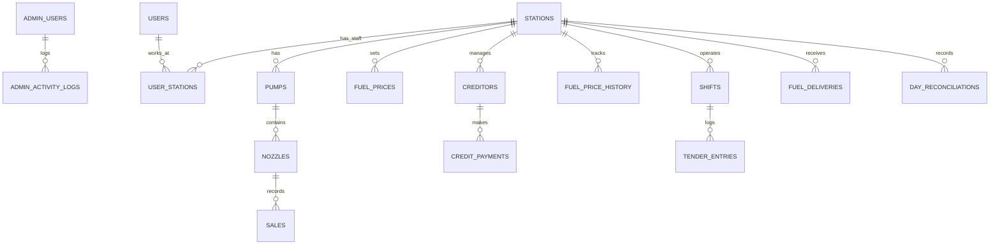

```mermaid
erDiagram
    ADMIN_USERS ||--o{ ADMIN_ACTIVITY_LOGS : "logs"
    USERS ||--o{ USER_STATIONS : "works_at"
    STATIONS ||--o{ USER_STATIONS : "has_staff"
    STATIONS ||--o{ PUMPS : "has"
    PUMPS ||--o{ NOZZLES : "contains"
    NOZZLES ||--o{ SALES : "records"
    STATIONS ||--o{ FUEL_PRICES : "sets"
    STATIONS ||--o{ CREDITORS : "manages"
    CREDITORS ||--o{ CREDIT_PAYMENTS : "makes"
    STATIONS ||--o{ FUEL_PRICE_HISTORY : "tracks"
    STATIONS ||--o{ SHIFTS : "operates"
    SHIFTS ||--o{ TENDER_ENTRIES : "logs"
    STATIONS ||--o{ FUEL_DELIVERIES : "receives"
    STATIONS ||--o{ DAY_RECONCILIATIONS : "records"
```
