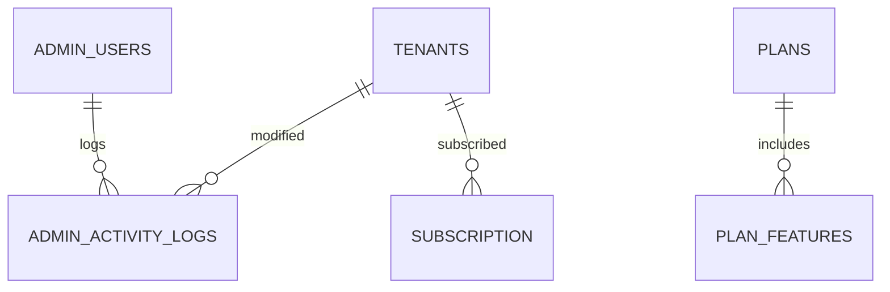

## 🛠 SUPERADMIN.md — SuperAdmin Manual for FuelSync Hub

This guide defines the core responsibilities, tools, and workflows available to **SuperAdmins** managing the FuelSync Hub platform.

---

## 🎯 SuperAdmin Overview

SuperAdmins are global administrators who manage platform-level concerns:

| Responsibility    | Description                                                |
| ----------------- | ---------------------------------------------------------- |
| Tenant Management | Create, edit, and delete fuel station tenants              |
| Plan Management   | Enforce plan limits via `planConfig.ts`                    |
| Logs & Monitoring | View logs, recent actions, and audit trails across tenants |
| System Health     | Validate database, reset schema, re-run seeds              |
| Documentation     | Regenerate Swagger UI, ERP matrix, and API summary docs    |
| Billing (Planned) | Monitor usage and integrate Stripe (future feature)        |

---

## 🗂 Public Schema Entities (SuperAdmin Domain)



---

## 🧪 Seeding, Testing & Resetting

```bash
# Seed default tenants + data
cd backend
npm run db:seed

# Clean all schemas (DEV ONLY!)
psql < db/scripts/clean_db.sql

# Run tests
npm test
```

---

## 📦 Tenant Creation Flow

SuperAdmins can create tenants from UI or CLI:

1. Add new tenant row in `tenants` (public schema)
2. Create schema `<schema_name>`
3. Clone base schema from `tenant_schema_template.sql`
4. Seed demo data in that schema (optional)

---

## 🔍 Logs & Activity

* All admin actions logged in `admin_activity_logs`
* User activity tracked in each tenant's `activity_logs`
* Logs include timestamp, actor, action, entity type/id

---

## 📄 API Tools & Documentation

* Start backend and access: `http://localhost:3001/docs`
* API spec generated from `api-spec.yaml`
* Summary available via `scripts/generate-api-docs.js`

---

## ⚙️ Configuration Reference

| Config File                  | Purpose                                  |
| ---------------------------- | ---------------------------------------- |
| `planConfig.ts`              | Defines Basic, Premium, Enterprise logic |
| `generate-erp-md.js`         | Updates ERP markdown matrix              |
| `generate-api-docs.js`       | Regenerates endpoint summary by role     |
| `tenant_schema_template.sql` | Blueprint for new tenant schemas         |

---

## 🧠 Best Practices

* Always test seeding after schema edits
* Keep ERP matrix, API docs, and config synced
* When in doubt: reseed → validate → test

---

> Keep this doc updated with all SuperAdmin operations. Next: see `TROUBLESHOOTING.md` for migrations & bug tracking.
